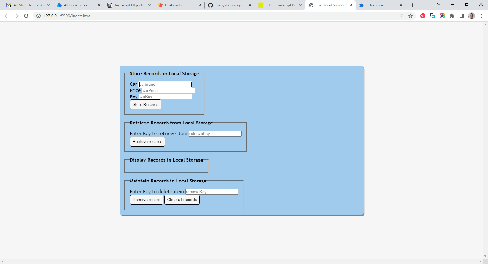

# Section.io - Local Storage OOP Beginner Project solution

This is a solution to the [Local Storage OOP Beginner Project on Section.io](https://www.section.io/engineering-education/how-to-use-localstorage-with-javascript/). I am trying to improve my coding skills by building realistic projects. 

## Table of contents

- [Overview](#overview)
  - [The challenge](#the-challenge)
  - [Screenshot](#screenshot)
  - [Links](#links)
- [My process](#my-process)
  - [Built with](#built-with)
  - [What I learned](#what-i-learned)
  - [Continued development](#continued-development)
  - [Useful resources](#useful-resources)
- [Author](#author)
- [Acknowledgments](#acknowledgments)

## Overview

### The challenge

Users should be able to:

- Now that we have learned about the primary functions of local storage, let’s create a web application that stores, retrieves, deletes, and clears items from local storage.  

### Screenshot

### Links

- Solution URL: [https://github.com/traez/local-storage-oop-beginner-project](https://github.com/traez/local-storage-oop-beginner-project)
- Live Site URL: [https://traez.github.io/local-storage-oop-beginner-project/](https://traez.github.io/local-storage-oop-beginner-project/)

## My process

### Built with

- Semantic HTML5 markup
- CSS custom properties
- Flexbox
- JavaScript

### What I learned

1) Nothing special here really. Just a Local Storage OOP Beginner project to get familiar with the matter 

### Continued development

With this small win, I have the confidence to tackle the following Object-Oriented Programming projects subsequently:  
1) Flashcard Intermediate/OOP Project from jsbeginners.com  
2) Crowdfunding product page coding challenge from Frontend Mentor  
3) Interactive comments section coding challenge from Frontend Mentor  

### Useful resources

Stackoverflow, MDN Web Docs, w3schools, YouTube, Google 

## Author

- Website - [Trae Zeeofor](https://github.com/traez)  
- Twitter - [@trae_z](https://twitter.com/trae_z) 

## Acknowledgments

Thanks for doing Africa proud Morocco at the WorldCup
